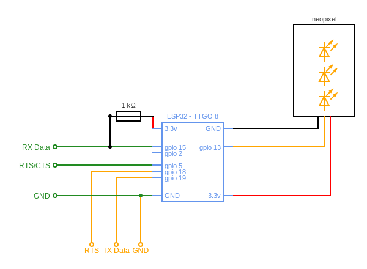
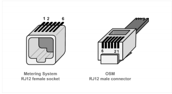
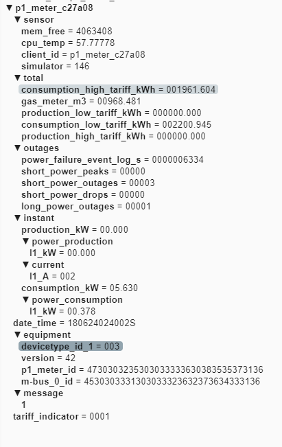

# What is this 


  * a sensor device that 
    - connects to your electricity meter
    - activates the output
    - reads the OBIS coded information 
    - runs a CRC check 
    - translates the codes to readable topics
    - publishes them to a MQTT server on your network
    - so you can read the information in HomeAssistant (or any other tool) 
    - most of it is configurable in a simple config file 
  * in addition it 
    - logs a few relevant sensors statistics to MQTT ( memory, CPY core temperature)
    - can view logs and other terminal output over wifi via the webrepl
    - can update configuration over FTP using just about any FTP tool 
    - uses mDns to connect the mqtt avoiding the need for fixed IP addresses or static DNS leases

- how does it work
  
  [Diagram]

- show me some pictures 
   [a few screenshots / photos]


## Hardware & Firmware 
 - just about any ESP32 board 
 - configured with micropython 1.13 or newer  
   http://micropython.org/download/esp32/
    - ESP32 GENERIC-SPIRAM : [esp32spiram-idf3-20200902-v1.13.bin](http://micropython.org/resources/firmware/esp32spiram-idf3-20200902-v1.13.bin)
 - memory:   
   no SPI ram is required,  the firmware auto detects if it is present and runs on either.

## install the P1 meter software on the ESP32 MCU
 - git clone this repo
  - adjust config.py settings :
    - homenet : WiFi SSID and Password 
    - broker : MQtt broker address, port, user and password
    - RX pins to connect to the P1 Port
    - Options (TX pin if you want to test drive without a connection to a P1 port)
 - upload code from /src folder to the board
    - flash Micropython 1.13 or newer ( 1 time) 
    - upload the source code ( using pymakr or any other tool)
  - reboot the board 


### Assembling the P1 meter circuit diagram
the circuit is quite simple:

  1.  ESP32, any devkit will do and will allow you to simply flash the Firmware and power the ESP by USB
  2.  a 1K Ohm resistor , needed to stabilize the serial data by pulling it to +3.3 volt 
  3.  a female RJ-12 (or RJ11) connector, or you could solder a 4 wire phone cable directly to the board 
optionally
  4.  some sort of case / box or container 
  5.  a small piece of perfboard , although if you want it should be able to solder directly on the devkit as well
  3.  a string of 3 neopixel leds to provide status on Network , MQTT and the received P1 data, 
      if you rather want a few simple leds to provide signals  there are enough pins left , but switched to neopixels to simplify the wiring.
      the code should be in one of the earlier commits.



The ESP hardware UART 1 is used to connect to pin 2 ( you specify in config.py 
this allows normal functionality to use the USB port (UART 0) for configuration and monitoring of the ESP32.

### Connection to P1 meter 

The RJ12 connector in the electricity meter uses the following layout 


Connect the ESP32 to an RJ12 cable/connector following the diagram.

**connection via straight 4/6 wire cable :**
Note that this will reverse the pin numbers on the female connector that you are using

| RJ12 P1       | cable|RJ12 Meter| ESP32 Pin | color     | 4w test cable | comments
| --------------|----- |----------| ----------| ----------|---------------|------------
| 1 - 5v out    | ---> | 6        | 5v or Vin |           |               | [Optional]. max 250 mA When using a 6 pin cable you can use the power source provided by the meter.
| 2 - CTS       | <--- | 5        | gpio-5    | blue      |  zwart        | Clear to Send,  High = allow P1 Meter to send data
| 3 - Data GND  | <--> | 4        | GND       | black     |  rood         | 
| 4 - -         |      | 3        | -         |           |  groen        | 
| 5 - RXD (data)| ---> | 2        | gpio-2    | yellow    |  geel         | 1K external pull-up resistor needed
| 6 - Power GND | ---- | 1        | GND       |           |               | [Optional]


## operation

3 Neopixel Leds (top to bottom):

|led| purpose | Red           | Green                    | other
|---|---------|---------------|--------------------------|---
| 2 | P1 meter| CRC Error     | CRC OK                   | **Blue**: data received , **Purple** : Simulator sending Data
| 1 | mqtt    | Not connected | Connected to MQTT broker | **Yellow**: Data could not be send to Broker
| 0 | wifi    | Not connected | IP address acquired      |

### configuration file 

<document What to change in the config file>

Please adjust the relevant settings in [config.py](src/config.py)
``` python
# Serial Pins for meter connection
# TX pin is only used for testing/simulation but needs to be specified
RX_PIN_NR = const(2)
TX_PIN_NR = const(15)
RTS_PIN_NR = const(5)

# Base SSID to connect to
homenet = {'SSID': 'IoT', 'password': 'MicroPython'}

#the mqtt broker to connect to
broker = {'server': 'homeassistant.local', 'user': 'sensor', 'password': 'beepbeep'}

NETWORK_ID = b'p1_meter_' + hexlify(unique_id())
ROOT_TOPIC = b"p1_meter"

#also publish telegram as json
publish_as_json = False
```


### Prereqs : 
 - git client
 - python 3.x installed 

### Recommended: 
 - vscode
 - pymakr extension
 - pip install micropy-cli 


### building


As the software is written in Micropython building is not needed. if you really want or need to minimize the footprint on the device you can pre-compile the .py files to .mpy using the micropython cross-compiler


### Testing
You can run the built-in  simulator for testing (using TX_PIN_NR)

  - connect the rx and tx pins with a wire 
  ``` python
    # Serial Pins for meter connection
    # TX pin is only used for testing/simulation but needs to be specified
    RX_PIN_NR = const(2)
    TX_PIN_NR = const(15)
    CTS_PIN_NR = const(5)

    #------------------------------------------------
    # A few Leds - optional
    NEOPIXEL_PIN = const(13)

  ```
    - edit the configuration file `config.py` to enable the Simulator 
  ``` python
      RUN_SIM = True
  ````    
## Simulation / test mode 
The p1 meter comes with a built-in test and simulation mode that allows you to test and  change the software, without needing to physically connect it to a electricity meter.

this simulation mode can be enabled  by wiring, or by making a change to the config.py file 

To enable this wia wiring: 
 1. Connect Pin 18 --> GND , enable Simulator 
 2. Connect Pin 15 --> Pin 2 , connect simulator TX to RX 

**By default:**  
- the root topic is changed 
- a fake P1 message is generated every 10 seconds on Pin 15 
  - this message has a few random values added to it 
  - the CRC16 is calculated before sending
- the message is passed of the serial connect ( see .2 above) to the input 
- the message is is processed by the normal software and sent to mqtt usign a different root topic to avoid interfering with actual input..



To change the fake message see [p1meter_sym.py](src/p1meter_sym.py)

