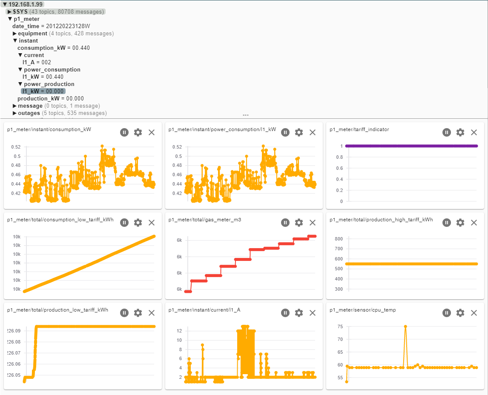
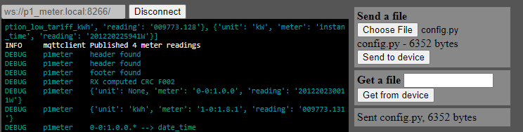
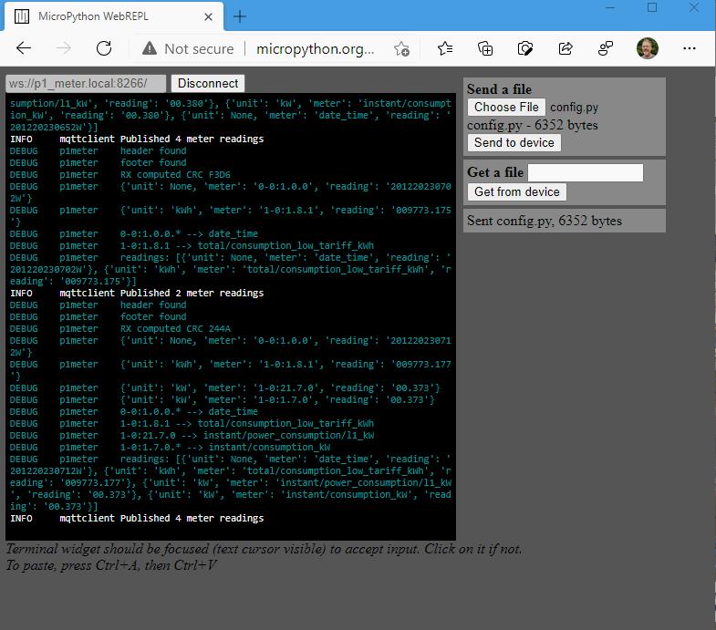
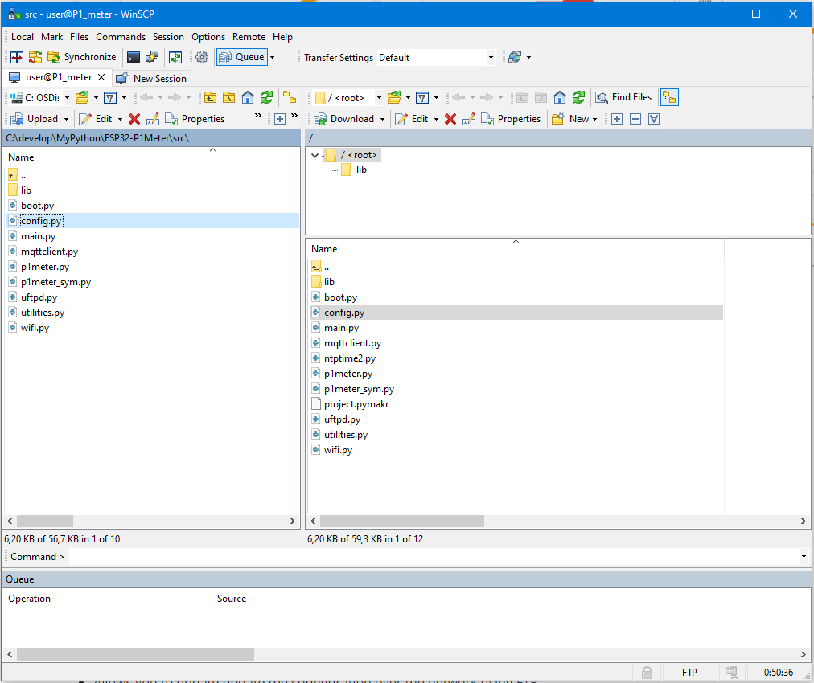

# MicroPython P1 meter 




Overview 


If you want to monitor your energy usage


**The P1_Meter is a a sensor device that:** 

- connects to your electricity meter's P1 port 
- Reads the P1 output using one of the ESP32 hardware UARTs
- reads the OBIS coded information 
- runs a CRC check on the received information to suppress incorrect readings
- translates the OBIS codes to readable topics
- publishes the information to a MQTT server on your network
- so you can read the information in HomeAssistant (or any other tool) 
- uses mDns to simplify configuration and avoid the need for fixed IP addresses or static DNS leases
- allows the configuration to be changed though a simple config file 

**in addition it:** 

- logs a few relevant sensors statistics to MQTT (client_id,  free memory, CPU core temperature)
- Allows you to view logs and other terminal output over wifi via the webrepl
- Allows you to update update the configuration over the network using FTP 

- how does it work
  
  [Diagram]

- show me some pictures 
   [a few screenshots / photos]


## Hardware & Firmware 
**Hardware:** 

 - Any ESP32 board
   no SPI ram is required,  the firmware auto detects if it is present and runs on either.
 - A single 1K Ohm resistor 
 - A cable with a 4 or 6 pin RJ12 connector 
   (optionally a 4 pin RJ11 connector and be used) 
 - Some sort of casing 
 - Optional: a sort strip of 3 neopixels to use as indicators.
   

**Firmware:**

 - Use micropython 1.13 for or newer for the esp32 http://micropython.org/download/esp32/
   you can download the firmware directly from 
   
    - ESP32 GENERIC-SPIRAM : [esp32spiram-idf3-20200902-v1.13.bin](http://micropython.org/resources/firmware/esp32spiram-idf3-20200902-v1.13.bin)
   
 - Install the micropython firmware to the ESP32 using the procedure documented in:
   [Getting started with MicroPython on the ESP32 — MicroPython 1.13 documentation](http://docs.micropython.org/en/latest/esp32/tutorial/intro.html#deploying-the-firmware)

 - the code in this repo; see the next paragraph.

   

## Install the P1 meter software on the ESP32 MCU
 - git clone this repo
  - adjust config.py settings :
    - homenet : WiFi SSID and Password 
    - broker : MQtt broker address, port, user and password
    - RX pins to connect to the P1 Port
    - Options (TX pin if you want to test drive without a connection to a P1 port)
 - upload code from /src folder to the board
    - flash Micropython 1.13 or newer ( 1 time) 
    - upload the source code ( using pymakr or any other tool)
  - reboot the board 


### Assembling the P1 meter circuit diagram
the circuit is quite simple:

  1.  ESP32, any devkit will do and will allow you to simply flash the Firmware and power the ESP by USB
  2.  a 1K Ohm resistor , needed to stabilize the serial data by pulling it to +3.3 volt 
  3.  a female RJ-12 (or RJ11) connector, or you could solder a 4 wire phone cable directly to the board 
optionally
  4.  some sort of case / box or container 
  5.  a small piece of perfboard , although if you want it should be able to solder directly on the devkit as well
  3.  a string of 3 neopixel leds to provide status on Network , MQTT and the received P1 data, 
      if you rather want a few simple leds to provide signals  there are enough pins left , but switched to neopixels to simplify the wiring.
      the code should be in one of the earlier commits.

 


The ESP hardware UART 1 is used to connect to pin 2 ( you specify in config.py 
this allows normal functionality to use the USB port (UART 0) for configuration and monitoring of the ESP32.

### Connection to P1 meter 

The RJ12 connector in the electricity meter uses the following layout 


Connect the ESP32 to an RJ12 cable/connector using the below diagram.

**Connection via straight 4/6 wire cable :**  
*Note:* This will reverse the pin numbers on the female connector that you are using

| RJ12 P1       | cable|RJ12 Meter| ESP32 Pin | RJ12 6w cable | 4w cable| comments
| --------------|----- |----------| ----------| ----------|---------|------------
| 1 - 5v out    | ===> | 6        | 5v or Vin |           |         | [Optional] 1️⃣ 
| 2 - CTS       | <--- | 5        | gpio-5    | blue      | black   | Clear to Send,  High = allow P1 Meter to send data
| 3 - Data GND  | ---- | 4        | GND       | black     | red     | 
| 4 - nc        |      | 3        | -         |           | green   | 
| 5 - RXD (data)| ---> | 2        | gpio-15   | yellow    | yellow  | 1K external pull-up resistor needed
| 6 - Power GND | <=== | 1        | GND       |           |         | [Optional] 1️⃣

1️⃣ max 250 mA When using a 6 pin cable you can use the power source provided by the meter.


## Adjusting for Straight or Cross cables


If you are unsure which cable will be used to connect,
or if you want to build some flexibility in your hardware design , it is possible to allow both cable types by :
 - Output connecting both Pin 3 and Pin 4  Ground 

this will ten allow you to swap the functions of pin 18 and 19 from 
- CTS / RXD  for a straight cable
- RDX / CTS for a cross cable

| RJ12 P1       | cable| Straight Cable | Cross Cable| -
| --------------|----- |----------|---------- |-
| 1 - 5v out    | ===> | 1        | 6         | not connected
| 2 - CTS       | <--- | 2        | 5         | CTS / RXD  software select
| 3 - GND data  | ---- | 3        | 4         | \ GND
| 4 - GND data  | ---- | 4        | 3         | / GND
| 5 - RXD (data)| ---> | 5        | 2         | RDX / CTS software select
| 6 - GND power | <=== | 6        | 1         | not connected

I recommend that in this design you do not connect the Power 5v to your board 


# Internal wiring:

## P1 In Connector 
ESP32 Pin | Color      | Female Connector |
----------|------------|------------------
GND       | black      | pin 4 & 3 
gpio-2    | pale blue  | pin 5
gpio-5    | yellow/blk | pin 2 | 

## operation

3 Neopixel Leds (top to bottom):

|led| purpose | Red           | Green                    | other
|---|---------|---------------|--------------------------|---
| 2 | P1 meter| CRC Error     | CRC OK                   | **Blue**: data received , **Purple** : Simulator sending Data
| 1 | mqtt    | Not connected | Connected to MQTT broker | **Yellow**: Data could not be send to Broker
| 0 | wifi    | Not connected | IP address acquired      |

### configuration file 

<document What to change in the config file>

Please adjust the relevant settings in [config.py](src/config.py)
``` python
# Serial Pins for meter connection
# TX pin is only used for testing/simulation but needs to be specified
RX_PIN_NR = const(2)
TX_PIN_NR = const(15)
RTS_PIN_NR = const(5)

# Base SSID to connect to
homenet = {'SSID': 'IoT', 'password': 'MicroPython'}

#the mqtt broker to connect to
broker = {'server': 'homeassistant.local', 'user': 'sensor', 'password': 'beepbeep'}

HOST_NAME = b'p1_meter_' + hexlify(unique_id())
ROOT_TOPIC = b"p1_meter"

#also publish telegram as json
publish_as_json = False
```

#### Configuration for Belgian DSMR Meters

If you're using a Belgian DSMR meter, you need to update the gas meter OBIS code in the `codetable` in [config.py](src/config.py). 

Change the line:
```python
("(\d)-1:24.2.1"        , "total/gas_meter"),
```
to:
```python
("0-1:24.2.3"           , "total/gas_meter"),
```

This change is necessary because Belgian meters use a different OBIS code for gas consumption readings compared to Dutch meters.


## Updating the configuration over WiFi

Assuming that you have cloned the repo to your PC , and have updated the configuration file  `config.py` . 
You will need to transfer the updated configuration file to the ESP32. 

You can do this via serial connection, or as the  P1_meter and your pc are likely in in different locations you can do this over WifI 


### Uploading config.py using webrepl

The MicroPython webrepl is started as part of the standard configuration, and advertises itself as `p1_meter.local` using the standard webrepl port (8266).

If you are on the same network , this allows you to connect to the P1_meter to verify its operation.

The below link uses the hosted webrepl, and specifies the board to connect to.
http://micropython.org/webrepl/#p1_meter.local:8266/

 

1. [Connect] to the board 

2. Enter the current webrepl password. default: p1meter

3. Select the config.py file to upload

4. click [Send to device]

5. Click in the terminal window 

6. Press Ctrl-C once, to interrupt the running instance.
   You should see something like the below, and the 3 leds will turn red 

   ```
   INFO     mqttclient Published 4 meter readings                                  
   INFO     main       Clear async loop retained state                             
   Rebooting in 30 seconds, Ctrl-C to abort  
   ```

7. the device will automatically reboot in 30 seconds, and the new configuration will be activated.

 


### Updating configuration or code via passive ftp 





### Prereqs : 

 - git client
 - python 3.x installed 

### Recommended: 
 - vscode
 - pymakr extension
 - pip install micropy-cli 


### Building


As the software is written in Micropython building is not needed. if you really want or need to minimize the footprint on the device you can pre-compile the .py files to .mpy using the micropython cross-compiler


### Testing
You can run the built-in  simulator for testing (using TX_PIN_NR)

  - connect the rx and tx pins with a wire 
  ``` python
    # Serial Pins for meter connection
    # TX pin is only used for testing/simulation but needs to be specified
    RX_PIN_NR = const(2)
    TX_PIN_NR = const(15)
    CTS_PIN_NR = const(5)

    #------------------------------------------------
    # A few Leds - optional
    NEOPIXEL_PIN = const(13)

  ```
    - edit the configuration file `config.py` to enable the Simulator 
  ``` python
      RUN_SIM = True
````
## Simulation / test mode 
The p1 meter comes with a built-in test and simulation mode that allows you to test and  change the software, without needing to physically connect it to a electricity meter.

this simulation mode can be enabled  by wiring, or by making a change to the config.py file 

To enable this via wiring: 
 1. Connect Pin 18 --> GND , enable Simulator 
 2. Connect Pin 15 --> Pin 2 , connect simulator TX to RX 

**By default:**  
- the root topic is changed 
- a fake P1 message is generated every 10 seconds on Pin 15 
  - this message has a few random values added to it 
  - the CRC16 is calculated before sending
- the message is passed of the serial connect ( see .2 above) to the input 
- the message is is processed by the normal software and sent to mqtt using a different root topic to avoid interfering with actual input..


To change the fake message see [p1meter_sym.py](src/p1meter_sym.py)

